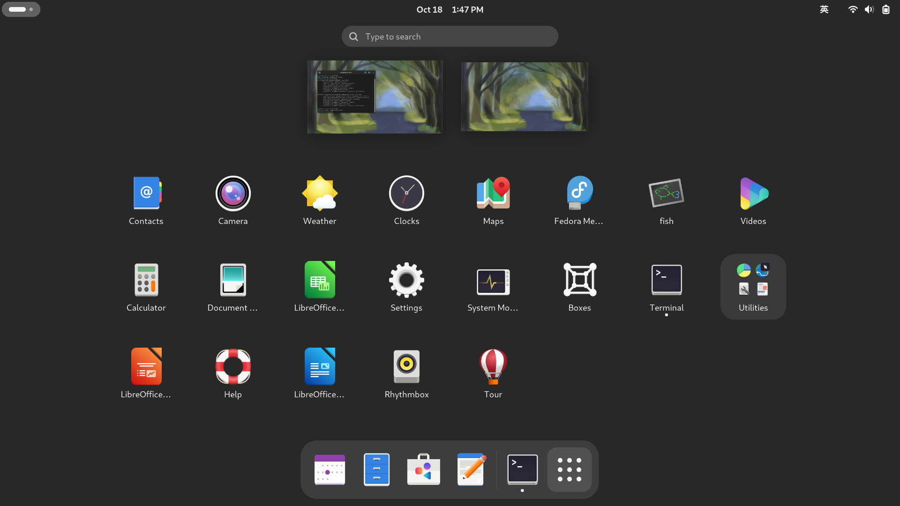
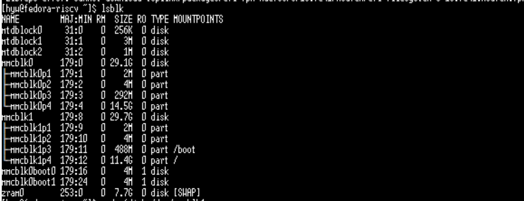
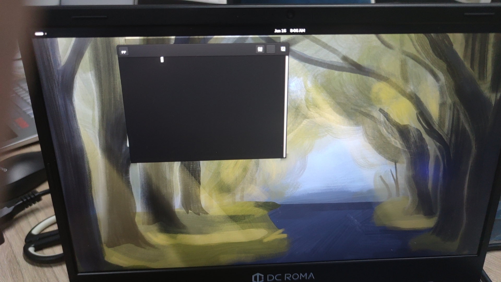

# 测试报告（DC-ROMA Ⅰ）

## 测试总结

### 测试环境：

- 硬件环境：DC-ROMA Ⅰ
- 系统版本：fedora-disk-gnome-workstation_deepcomputing_roma-sda.raw.gz
- 镜像MD5：350bcae3e959f13b9e6e91f2a5493611
- 内存：xx
- 内核版本：Linux fedora-riscv 5.15.0 #2 SMP Thu Jun 20 02:20:24 EDT 2024 riscv64 GNU/Linux
- 固件版本：xxx
- 测试日期：2024.10. 23

### 功能测试：

- Fedora镜像测试
    
    校验镜像MD5：pass
    
    镜像启动测试：pass
    
    桌面环境测试：fail
    
    系统分区扩容功能：pass
    
    注册用户功能：pass
    
    系统更新功能：pass
    
    内核模块加载功能：pass
    
- USB-hub功能测试
    
    识别USB键盘：pass
    
    识别USB鼠标：pass
    
    识别U盘：pass
    
    识别移动硬盘：pass
    
- 主机硬件功能
    
    触摸板（i2c）功能：pass
    
    键盘功能：pass
    
    摄像头（usb）功能：fail
    
    喇叭、麦克风功能：fail
    
    耳机功能：fail
    
    光感功能：fail
    
- 系统软件功能
    
    Wi-Fi on/off功能：fail
    
    BT蓝牙功能：fail
    
    休眠唤醒功能：fail
    
    firefox/chrome浏览器功能：pass
    
    VLC播放器功能：fail
    

Typec转HDMI（左上口）：psss

Typec转Jlink（左下口）：无工具

Typec转Uart（右下口）：pass

### 性能测试：

- Fedora系统性能测试
    
    CPU性能测试：pass
    
    内存测试：pass
    
    磁盘I/O测试：pass
    
    系统启动时间测试：pass
    
    系统关闭时间测试：pass
    
    系统响应时间测试：pass
    
- USB-读写速度测试
    - JEYI：3.0 typec转-SSD（Samsung SSD 970 EVO Plus 1TB）
        - typec左口：rewriters :  130MB/s              readers：199MB/s
    - 3.0 U盘（ERAZER）  Disk model: F500Pro 128GB
        - typea左口：rewriters :  189MB/s                  readers：122MB/s
        - typea右口：rewriters :  189MB/s                  readers：122MB/s
    - 3.0 读卡器（川宇）接闪迪U3  32GB Disk model: USB3.0 CRW
        - typea左口：rewriters ：35.0MB/s             readers：72.5MB/s
        - typea右口：rewriters ：35.0MB/s             readers：72.5MB/s
    - 3.0 读卡器（川宇）接闪迪U1  32GB Disk model: USB3.0 CRW：无工具
        - typea左口：rewriters :                     readers：
        - typea右口：rewriters :                     readers：
    - 2.0 U盘  128GB    Disk model: Innostor：
        - typea左口：rewriters :    3.5MB/s             readers：13.7MB/s
        - typea右口：rewriters :    3.5MB/s             readers：13.7MB/s
- SDcard读写速度测试
    - 闪迪U3  32GB，板端卡槽
        - rewriters：32.0MB/s
        - readers：22.9MB/s
- EMMC-读写速度测试：无接口
    - EMMC，江波龙32GB
        - rewriters：
        - readers：
    - EMMC，三星32GB
        - rewriters：
        - readers：

### EC测试：

- 主机模式（未插电池）：
    - 仅用电源供电：pass
- 电脑模式（插上电池）：
    - 电池电量0%，且开不起机：pass
    - 电池电量50%：pass
    - 电池电量90%：pass
    - 电池电量100%：pass

## 测试流程

1、下载镜像后校验MD5，md5为6F704B97590E3C01150AA18FACA6D0DC，与网站校验一致

2、烧写镜像到SD卡，通过SD卡启动，下附启动log文件

3、检查fedora桌面环境的功能是否完整，包括窗口管理、文件管理、系统设置等



4、系统分区扩容功能测试流程：

（1）查看磁盘信息

`lsblk`



（2）分区管理

`sudo fdisk /dev/mmcblk1`


（3）输入p查看磁盘信息


（4）输入e，选择需要调整的分区。然后指定分区的大小，我这边设置20G。然后w保存


（5）再次查看磁盘信息，发现分区扩容


5、注册用户功能测试流程：pass

（1）使用命令注册用户

```jsx
sudo useradd -G wheel -m hyw3

sudo passwd hyw3
```

（2）切换登录新注册的用户


6、系统更新功能：

`sudo dnf upgrade`


7、内核模块加载功能测试流程：

`lsmod`


8、USB-hub功能测试流程：将外接usb设备插入笔电，终端输入lsusb查看是否能识别usb设备

`lsusb`


9、主机硬件功能测试流程：

- 触摸板（i2c）：操作触摸板控制，移动流畅不卡顿，按键反应速度快
- 键盘：进入在线键盘测试，测试各个按键（功能键）是否正确
- 摄像头（usb）：打开摄像机APP，查看是否能够正常出像
- 喇叭、麦克风：进入设置内Sound，测试左右声道
- 耳机：插入耳机，进入设置内Sound，测试左右声道
- 光感功能：遮住/放开光感孔

10、系统软件功能测试流程

- Wi-Fi on/off测试：能正常开关wifi，连接wifi能够访问网络
- BT蓝牙：能正常连接手机/电脑/耳机、键盘蓝牙，能播放音乐，传输文件
- 休眠唤醒：手动休眠后任意键唤醒
- firefox/chrome浏览器：能流畅访问网页，播放视频
- VLC播放器：能硬解播放1080P视频

11、Typec转HDMI（左上口）测试流程：

- 开机前插上HDMI（冷插拔）
- 开机后插上HDMI（热插拔）

12、Typec转Jlink（左下口）测试流程：使用EC烧录Jlink

13、Typec转Uart（右下口）测试流程：使用CH341串口小板连接

14、Fedora系统性能测试流程

- CPU性能测试：

（1）安装测试工具：

`sudo dnf install stress`


（2）输入以下命令然后开启另外一个终端输入top查看cpu信息

`stress --cpu 4 --io 2 --vm 2 --vm-bytes 128M --timeout 10s`


- 内存测试：

`stress --vm 2 --vm-bytes 128M --vm-hang 0 --timeout 10s`


- 磁盘I/O测试：

（1）安装测试工具

`sudo dnf install fio`


（2）输入以下命令测试

`fio --name=randwrite --ioengine=libaio --iodepth=1 --rw=randwrite --bs=4k --direct=1 --size=1G --numjobs=1 --runtime=60 --group_reporting`


- 系统启动时间测试：

`systemd-analyze`


- 系统关闭时间测试：

`time sudo shutdown -h now`


- 系统响应时间测试：

`sudo time find / -name "*.txt”`


15、USB-读写速度测试流程：

- JEYI：3.0 typec转-SSD（Samsung SSD 970 EVO Plus 1TB）
    
    （1）清理缓存
    
    `sudo sh -c "echo 1 > /proc/sys/vm/drop_caches"`
    
    （2）查看磁盘挂载情况
    
    `lsblk`
    
    
    
    （3）磁盘读写测试
    
    - 写速度：`sudo dd if=/dev/zero of=/mnt/usb/test  bs=1M count=1024  status=progress`
    
    
    
    - 读速度：`sudo dd if=/mnt/usb/test of=/dev/null  bs=1M count=1024  status=progress`
    
    
    

- 3.0 U盘（ERAZER）  Disk model: F500Pro 128GB
    
    （1）清理缓存
    
    `sudo sh -c "echo 1 > /proc/sys/vm/drop_caches"`
    
    （2）查看磁盘挂载情况
    
    `lsblk`
    
    
    
    （3）磁盘读写测试
    
    - 写速度：`sudo dd if=/dev/zero of=/run/media/hyw/CECA-9BC5/test  bs=1M count=1024  status=progress`
    
    
    
    - 读速度：`sudo dd if=/run/media/hyw/CECA-9BC5/test of=/dev/null  bs=1M count=1024  status=progress`
    
    
    

- 3.0 读卡器（川宇）接闪迪U3  32GB Disk model: USB3.0 CRW
    
    （1）清理缓存
    
    `sudo sh -c "echo 1 > /proc/sys/vm/drop_caches"`
    
    （2）查看磁盘挂载情况
    
    `lsblk`
    
    
    
    （3）磁盘读写测试
    
    - 写速度：`sudo dd if=/dev/zero of=/run/media/hyw/B23E-9752/test  bs=1M count=1024  status=progress`
    
    
    
    - 读速度：`sudo dd if=/run/media/hyw/B23E-9752/test of=/dev/null bs=1M count=1024 status=progress`
    
    
    

- 3.0 读卡器（川宇）接闪迪U1  32GB Disk model: USB3.0 CRW
    
    

- 2.0 U盘  128GB    Disk model: Innostor
    
    （1）清理缓存
    
    `sudo sh -c "echo 1 > /proc/sys/vm/drop_caches"`
    
    （2）查看磁盘挂载情况
    
    `lsblk`
    
    
    
    （3）磁盘读写测试
    
    - 写速度：`sudo dd if=/dev/zero of=/run/media/hyw/0EE4-0F0A/test bs=1M count=1024 status=progress`
    
    
    
    - 读速度：`sudo dd if=/run/media/hyw/0EE4-0F0A/test of=/dev/null  bs=1M count=1024 status=progress`
    
    
    

16、SDcard读写速度测试流程：

- 闪迪U3  32GB，板端卡槽

（1）清理缓存

`sudo sh -c "echo 1 > /proc/sys/vm/drop_caches"`

（2）查看磁盘挂载情况


（3）磁盘读写测试

- 写速度：`sudo dd if=/dev/zero of=/test  bs=1M count=1024  status=progress`


- 读速度：`sudo dd if=/test of=/dev/null bs=1M count=1024 status=progress`


17、EMMC-读写速度测试流程：同上SD卡测试流程一致

## 异常情况汇总

1、鼠标光标异常:

2、桌面终端显示异常：终端字体不显示，下附启动log



3、摄像头异常：打开相机APP，识别不到摄像头，下赋dmesg日志


4、喇叭、麦克风功能异常：扬声器无声音发出

5、耳机功能异常：耳机不出声

6、光感功能异常：遮盖感光元件屏幕亮度未变化

7、Wi-Fi on/off功能异常：系统中无此功能，需输入sudo systemctl restart NetworkManager命令后才有WiFi功能，但笔电关机重启后还是无wifi功能

8、BT蓝牙功能异常：没有识别到蓝牙硬件


9、休眠唤醒异常：下面是休眠后打印的内核信息

[ 5233.518024] cdns-dsi 295d0000.mipi: STOP dsi ppi_txbyte_hs
[ 5233.523704] cdns-dsi 295d0000.mipi: sys_mipi_dsi_set_ppi_txbyte_hs
[ 5233.529992] sf-mipi-dphy-tx 295e0000.mipi-dphy: 1 SET_U0_MIPITX_DPHY_RESETB
[ 5233.537081] sf-mipi-dphy-tx 295e0000.mipi-dphy: 2 SET_U0_MIPITX_DPHY_RESETB
[ 5234.770154] PM: suspend entry (s2idle)
[ 5234.927374] Filesystems sync: 0.153 seconds
[ 5234.959509] Freezing user space processes ... (elapsed 0.002 seconds) done.
[ 5234.968598] OOM killer disabled.
[ 5234.971892] Freezing remaining freezable tasks ... (elapsed 0.001 seconds) done.
[ 5234.980768] printk: Suspending console(s) (use no_console_suspend to debug)

10、VLC播放器功能异常：打开后调节音量会关闭应用程序，下面是异常关闭内核信息

 [ 3986.199197] vlc[8617]: unhandled signal 11 code 0x1 at 0x0000000000000028 in libc.so.6[3f7fb75000+e9000]
[ 3986.208988] CPU: 2 PID: 8617 Comm: vlc Tainted: G           O      5.15.0 #2
[ 3986.216086] Hardware name: StarFive VisionFive V2 (DT)
[ 3986.221276] epc : 0000003f7fbc6dda ra : 0000003f7187b6c0 sp : 0000003f68aa6510
[ 3986.228519]  gp : 0000002abb524800 tp : 0000003f68aa8800 t0 : 0000000000000270
[ 3986.235748]  t1 : 0000003f7183134c t2 : 0000000000000000 s0 : 0000003f68aa6540
[ 3986.242989]  s1 : 0000000000000000 a0 : 0000000000000018 a1 : 0000000000000000
[ 3986.250231]  a2 : 0000003f68aa6758 a3 : 0000002abb5baa00 a4 : 0000000000000000
[ 3986.257458]  a5 : 0000000000000028 a6 : 0000000000000000 a7 : 0000000000000040
[ 3986.264697]  s2 : 0000003f7fd59ca8 s3 : 0000003f7fb429b0 s4 : 0000002abb5b9288
[ 3986.271940]  s5 : 0000003f5c08a240 s6 : 0000000000000020 s7 : 0000003f7fd59ca8
[ 3986.279181]  s8 : 0000003f5c3718b0 s9 : 0000003f5c3bbe80 s10: 0000003f68aa66b0
[ 3986.286410]  s11: 0000003f5c000d40 t3 : 0000003f7fbc6dd6 t4 : 0000000000000000
[ 3986.293656]  t5 : 00000003b9d623f9 t6 : 0000000000000271
[ 3986.298995] status: 8000000200006020 badaddr: 0000000000000028 cause: 000000000000000d

11、EC测试异常：主机模式（未插电池）：仅用电源供电：概率性出现开机后不进入系统（测试10次出现一次，根据bug出现的操作重复进行，复现失败。）

## 测试log文件

[sd卡启动log.txt](assets/sd.txt)

[摄像头异常log.txt](assets/摄像头异常log.txt)

## excle测试文档

[fedora测试用例（DC-ROMA Ⅰ）.xlsx](assets/fedora测试用例.xlsx)

[Fedora Test.xlsx](assets/Fedora_Test.xlsx)