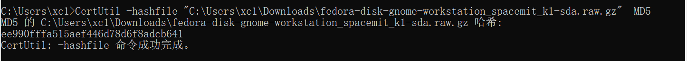
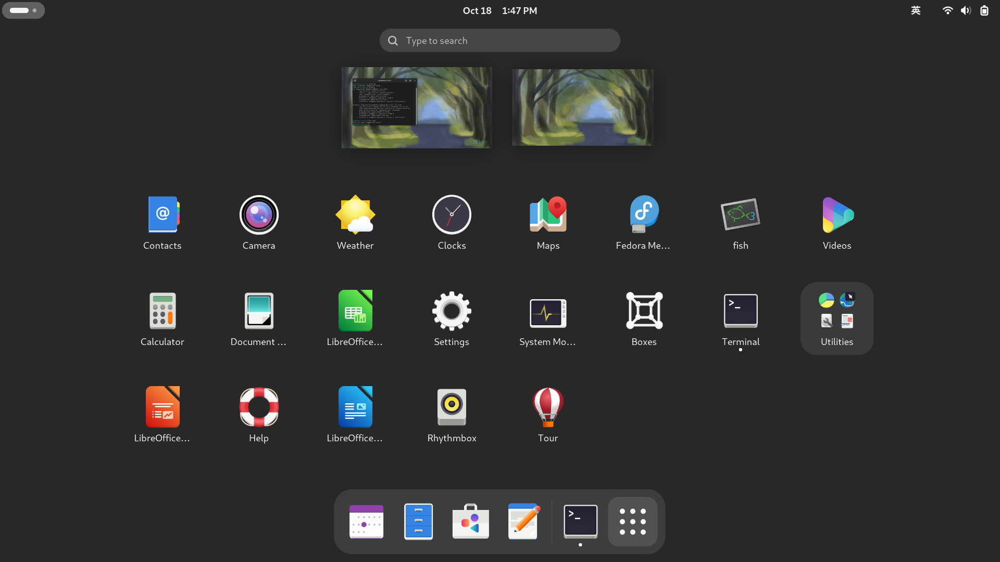

# 测试报告（DC-ROMA Ⅱ fedora）

## 测试总结

### 测试环境：

- 硬件环境：DC-ROMA Ⅱ
- 系统版本：fedora-disk-gnome-workstation_spacemit_k1-sda .raw
- 镜像MD5：ee990fffa515aef446d78d6f8adcb641
- 内存：板载8Gb BWMZCX32H2A
- 内核版本：Linux fedora-riscv 6.6.36+ #4 SMP PREEMPT Wed Oct  9 20:22:26 CST 2024 riscv64 GNU/Linux
- 固件版本：xxx
- 测试日期：2024.10. 21

### 功能测试：

- Fedora镜像测试
    
    校验镜像MD5：pass
    
    镜像启动测试：pass
    
    桌面环境测试：pass
    
    系统分区扩容功能：pass
    
    注册用户功能：pass
    
    系统更新功能：pass
    
    内核模块加载功能：pass
    
- USB-hub功能测试
    
    识别USB键盘：pass
    
    识别USB鼠标：pass
    
    识别U盘：pass
    
    识别移动硬盘：pass
    
- 主机硬件功能
    
    触摸板（i2c）功能：pass
    
    键盘功能：pass
    
    摄像头（usb）功能：fail
    
    喇叭、麦克风功能：pass
    
    耳机功能：pass
    
    光感功能：fail
    
- 系统软件功能
    
    Wi-Fi on/off功能：pass
    
    BT蓝牙功能：pass
    
    休眠唤醒功能：pass
    
    firefox/chrome浏览器功能：pass
    
    VLC播放器功能：pass
    

Typec转HDMI（左上口）：pass

Typec转Jlink（左下口）：无工具

Typec转Uart（右下口）：pass

### 性能测试：

- Fedora系统性能测试
    
    CPU性能测试：pass
    
    内存测试：pass
    
    磁盘I/O测试：pass
    
    系统启动时间测试：pass
    
    系统关闭时间测试：pass
    
    系统响应时间测试：pass
    
- USB-读写速度测试
    - JEYI：3.0 typec转-SSD（Samsung SSD 970 EVO Plus 1TB）
        - typec左上口：rewriters :  331MB/s                  readers：235MB/s
        - typec左下口：rewriters :  216MB/s                  readers：250MB/s
    - 3.0 U盘（ERAZER）  Disk model: F500Pro 128GB
        - typea左口：rewriters :  227MB/s                   readers：155MB/s
        - typea右口：rewriters :  227MB/s                   readers：155MB/s
    - 3.0 读卡器（川宇）接闪迪U3  32GB Disk model: USB3.0 CRW
        - typea左口：rewriters ：39.13MB/s                readers：82.4MB/s
        - typea右口：rewriters ：39.13MB/s                readers：82.4MB/s
    - 3.0 读卡器（川宇）接闪迪U1  32GB Disk model: USB3.0 CRW：无U1的SD卡工具
        - typea左口：rewriters :                     readers：
        - typea右口：rewriters :                     readers：
    - 2.0 U盘  128GB    Disk model: Innostor：
        - typea左口：rewriters :                     readers：
        - typea右口：rewriters :                     readers：
- SDcard读写速度测试
    - 闪迪U3  32GB，板端卡槽
        - rewriters：37.5MB/s
        - readers：89.0MB/s
- EMMC-读写速度测试：笔电未拆卸，无拆卸工具
    - EMMC，江波龙32GB
        - rewriters：
        - readers：
    - EMMC，三星32GB
        - rewriters：
        - readers：

### EC测试：

- 主机模式（未插电池）：
    - 仅用电源供电：pass
- 电脑模式（插上电池）：
    - 电池电量0%，且开不起机：pass
    - 电池电量50%：pass
    - 电池电量90%：pass
    - 电池电量100%：pass

## 测试流程

1、下载镜像后校验MD5，md5为6F704B97590E3C01150AA18FACA6D0DC，与网站校验一致

- Windows下的校验方法

`CertUtil -hashfile "C:\Users\xc1\Downloads\fedora-disk-gnome-workstation_spacemit_k1-sda.raw.gz"  MD5`



- fedora下的校验方法

2、烧写镜像到SD卡，通过SD卡启动镜像，下附启动log文件

3、检查fedora桌面环境的功能是否完整，包括窗口管理、文件管理、系统设置等



4、系统分区扩容功能测试流程：

（1）查看磁盘信息


（2）确认分区实际大小

`sudo fdisk -l /dev/nvme0n1p6`


（3）分区管理

`sudo fdisk /dev/nvme0n1`


（4）输入p查看磁盘信息


（5）输入e，选择需要调整的分区。然后指定分区的大小，我这边设置100G。然后w保存


（6）分区大小被调整后，更新分区表

`sudo partprobe /dev/nvme0n1`

（7）调整文件系统大小

`sudo resize2fs /dev/nvme0n1p6`


（8）再次查看磁盘信息，发现分区扩容


5、注册用户功能测试流程：

（1）使用命令注册用户

```jsx
sudo useradd -G wheel -m hyw3

sudo passwd hyw3
```

（2）切换登录新注册的用户


6、系统更新功能测试流程：

`sudo dnf upgrade`


7、内核模块加载功能测试流程：

`lsmod`


8、USB-hub功能测试流程：将外接usb设备插入笔电，终端输入lsusb查看是否能识别usb设备

`lsusb`


9、主机硬件功能测试流程：

- 触摸板（i2c）：操作触摸板控制，移动流畅不卡顿，按键反应速度快
- 键盘：进入在线键盘测试，测试各个按键（功能键）是否正确
- 摄像头（usb）：打开摄像机APP，查看是否能够正常出像
- 喇叭、麦克风：进入设置内Sound，测试左右声道
- 耳机：插入耳机，进入设置内Sound，测试左右声道
- 光感功能：遮住/放开光感孔

10、系统软件功能测试流程

- Wi-Fi on/off测试：能正常开关wifi，连接wifi能够访问网络
- BT蓝牙：能正常连接手机/电脑/耳机、键盘蓝牙，能播放音乐，传输文件
- 休眠唤醒：手动休眠后任意键唤醒
- firefox/chrome浏览器：能流畅访问网页，播放视频
- VLC播放器：能硬解播放1080P视频

11、Typec转HDMI（左上口）测试流程：

- 开机前插上HDMI（冷插拔）
- 开机后插上HDMI（热插拔）

12、Typec转Jlink（左下口）测试流程：使用EC烧录Jlink

13、Typec转Uart（右下口）测试流程：使用CH341串口小板连接

14、Fedora系统性能测试流程

- CPU性能测试：

（1）安装测试工具：

`sudo dnf install stress`


（2）输入以下命令然后开启另外一个终端输入top查看cpu信息

`stress --cpu 4 --io 2 --vm 2 --vm-bytes 128M --timeout 10s`


- 内存测试：

`stress --vm 2 --vm-bytes 128M --vm-hang 0 --timeout 10s`


- 磁盘I/O测试：

（1）安装测试工具

`sudo dnf install fio`


（2）输入以下命令测试

`fio --name=randwrite --ioengine=libaio --iodepth=1 --rw=randwrite --bs=4k --direct=1 --size=1G --numjobs=1 --runtime=60 --group_reporting`


- 系统启动时间测试：

`systemd-analyze`


- 系统关闭时间测试：

`time sudo shutdown -h now`


- 系统响应时间测试：

`time ls`


15、USB-读写速度测试流程：

- JEYI：3.0 typec转-SSD（Samsung SSD 970 EVO Plus 1TB）
    
    （1）清理缓存
    
    `sudo sh -c "echo 1 > /proc/sys/vm/drop_caches"`
    
    （2）查看磁盘挂载情况
    
    `lsblk`
    
    
    
    （3）磁盘读写测试
    
    - 写速度：`sudo dd if=/dev/zero of=/mnt/usb/test  bs=1M count=1024  status=progress`
    
    
    
    - 读速度：`sudo dd if=/mnt/usb/test of=/dev/null  bs=1M count=1024  status=progress`
    
    
    

- 3.0 U盘（ERAZER）  Disk model: F500Pro 128GB
    
    （1）清理缓存
    
    `sudo sh -c "echo 1 > /proc/sys/vm/drop_caches"`
    
    （2）查看磁盘挂载情况
    
    `lsblk`
    
    
    
    （3）磁盘读写测试
    
    - 写速度：`sudo dd if=/dev/zero of=/run/media/hyw/CECA-9BC5/test  bs=1M count=1024  status=progress`
    
    
    
    - 读速度：`sudo dd if=/run/media/hyw/CECA-9BC5/test of=/dev/null  bs=1M count=1024  status=progress`
    
    
    

- 3.0 读卡器（川宇）接闪迪U3  32GB Disk model: USB3.0 CRW
    
    （1）清理缓存
    
    `sudo sh -c "echo 1 > /proc/sys/vm/drop_caches"`
    
    （2）查看磁盘挂载情况
    
    `lsblk`
    
    
    
    （3）磁盘读写测试
    
    - 写速度：`sudo dd if=/dev/zero of=/run/media/hyw/CECA-9BC5/test  bs=1M count=1024  status=progress`
    
    
    
    - 读速度：`sudo dd if=/run/media/hyw/984E-D07F/test of=/dev/null bs=1M count=1024 status=progress`
    
    
    

- 3.0 读卡器（川宇）接闪迪U1  32GB Disk model: USB3.0 CRW
    
    

- 2.0 U盘  128GB    Disk model: Innostor
    
    （1）清理缓存
    
    `sudo sh -c "echo 1 > /proc/sys/vm/drop_caches"`
    
    （2）查看磁盘挂载情况
    
    `lsblk`
    
    
    
    （3）磁盘读写测试
    
    - 写速度：`sudo dd if=/dev/zero of=/run/media/hyw/0EE4-0F0A/test  bs=1M count=1024  status=progress`
    
    
    
    - 读速度：`sudo dd if=/run/media/hyw/0EE4-0F0A/test of=/dev/null bs=1M count=1024 status=progress`
    
    
    

12、SDcard读写速度测试流程：

- 闪迪U3  32GB，板端卡槽

（1）清理缓存

`sudo sh -c "echo 1 > /proc/sys/vm/drop_caches"`

（2）查看磁盘挂载情况

`lsblk`


（3）磁盘读写测试

- 写速度：`sudo dd if=/dev/zero of=/run/media/hyw/984E-D07F/test  bs=1M count=1024  status=progress`


- 读速度：`sudo dd if=/run/media/hyw/984E-D07F/test of=/dev/null bs=1M count=1024 status=progress`


16、EMMC-读写速度测试流程：同上SD卡测试流程一致

## 异常情况汇总

1、摄像头异常：打开相机APP，识别不到摄像头，下赋dmesg日志


2、光感功能异常：光感功能无效，遮挡后没有自动调节亮度

## 测试log文件

[SD卡启动日志.txt](assets/SD卡启动日志.txt)

[摄像头异常内核日志.txt](assets/摄像头异常内核日志.txt)

## excle测试文档

[fedora测试用例（DC-ROMA Ⅱ）.xlsx](assets/fedora测试用例.xlsx)

[Fedora Test.xlsx](assets/Fedora_Test.xlsx)